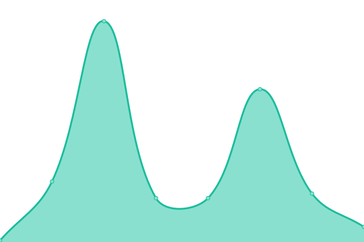

# [📈 Live Status](https://mijho.github.io/upptime): <!--live status--> **🟩 All systems operational**

This repository contains the open-source uptime monitor and status page for [Mark Johnson](https://mijho.github.io/upptime), powered by [Upptime](https://github.com/upptime/upptime).

With [Upptime](https://upptime.js.org), you can get your own unlimited and free uptime monitor and status page, powered entirely by a GitHub repository. We use [Issues](https://github.com/mijho/upptime/issues) as incident reports, [Actions](https://github.com/mijho/upptime/actions) as uptime monitors, and [Pages](https://mijho.github.io/upptime) for the status page.

<!--start: status pages-->
<!-- This summary is generated by Upptime (https://github.com/upptime/upptime) -->
<!-- Do not edit this manually, your changes will be overwritten -->
<!-- prettier-ignore -->
| URL | Status | History | Response Time | Uptime |
| --- | ------ | ------- | ------------- | ------ |
|  [Google](https://www.google.com) | 🟩 Up | [google.yml](https://github.com/mijho/upptime/commits/HEAD/history/google.yml) | 

 95ms
     
 | 

<a href="https://mijho.github.io/upptime/history/google">100.00%</a>
    

|  [Ambiguous Brush](https://ambiguousbrush-site.vercel.app/) | 🟩 Up | [ambiguous-brush.yml](https://github.com/mijho/upptime/commits/HEAD/history/ambiguous-brush.yml) | 

 1085ms
     
 | 

<a href="https://mijho.github.io/upptime/history/ambiguous-brush">99.22%</a>
    

|  [Stephen Johnson Art](https://stephenmjohnson.art) | 🟩 Up | [stephen-johnson-art.yml](https://github.com/mijho/upptime/commits/HEAD/history/stephen-johnson-art.yml) | 

 289ms
     
 | 

<a href="https://mijho.github.io/upptime/history/stephen-johnson-art">99.39%</a>
    

|  [Mirrorweb Website](https://www.mirrorweb.com/) | 🟩 Up | [mirrorweb-website.yml](https://github.com/mijho/upptime/commits/HEAD/history/mirrorweb-website.yml) | 

 163ms
     
 | 

<a href="https://mijho.github.io/upptime/history/mirrorweb-website">99.39%</a>
    

|  [Mirrorweb Portal](https://app.mirrorweb.com) | 🟩 Up | [mirrorweb-portal.yml](https://github.com/mijho/upptime/commits/HEAD/history/mirrorweb-portal.yml) | 

 1376ms
     
 | 

<a href="https://mijho.github.io/upptime/history/mirrorweb-portal">100.00%</a>
    

|  [TNA Webarchive Search](https://webarchive.nationalarchives.gov.uk/search/) | 🟩 Up | [tna-webarchive-search.yml](https://github.com/mijho/upptime/commits/HEAD/history/tna-webarchive-search.yml) | 

 659ms
     
 | 

<a href="https://mijho.github.io/upptime/history/tna-webarchive-search">100.00%</a>
    

|  [TNA Webarchive Social](https://webarchive.nationalarchives.gov.uk/video/) | 🟩 Up | [tna-webarchive-social.yml](https://github.com/mijho/upptime/commits/HEAD/history/tna-webarchive-social.yml) | 

 47ms
     
 | 

<a href="https://mijho.github.io/upptime/history/tna-webarchive-social">100.00%</a>
    

|  [Aschaffenburg](https://webseitenarchiv.stadtarchiv-digital.de/) | 🟩 Up | [aschaffenburg.yml](https://github.com/mijho/upptime/commits/HEAD/history/aschaffenburg.yml) | 

 701ms
     
 | 

<a href="https://mijho.github.io/upptime/history/aschaffenburg">100.00%</a>
    

|  [UK Parliament Web Archive](http://webarchive.parliament.uk/) | 🟩 Up | [uk-parliament-web-archive.yml](https://github.com/mijho/upptime/commits/HEAD/history/uk-parliament-web-archive.yml) | 

 467ms
     
 | 

<a href="https://mijho.github.io/upptime/history/uk-parliament-web-archive">100.00%</a>
    

<!--end: status pages-->

[**Visit our status website →**](https://mijho.github.io/upptime)

## 📄 License

- Powered by: [Upptime](https://github.com/upptime/upptime)
- Code: [MIT](./LICENSE) © [Mark Johnson](https://mijho.github.io/upptime)
- Data in the `./history` directory: [Open Database License](https://opendatacommons.org/licenses/odbl/1-0/)
